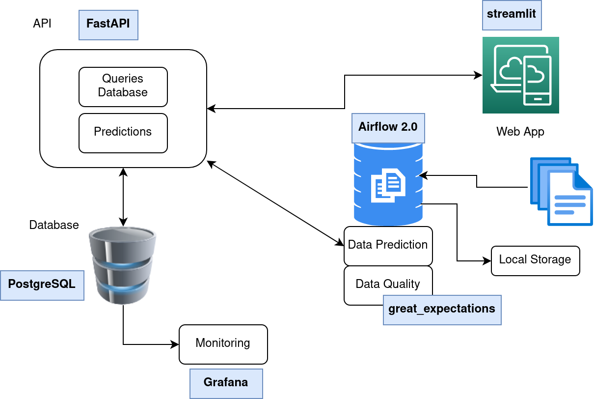

# Heart Stroke Predictions Model In Production

## Users : :stethoscope:
* Medical professionals :man_health_worker:
* Clinics / hospitals :hospital:
* Medical devices :microscope:

## Usage Description: :anatomical_heart:

After providing the necessary information to the health professionals of the user or inputting his or her personal & health information on the medical device or the Web Interface.
Our model will use the the information provided by the user above to predict the probability of him having a stroke. 
After that the Web interface will display a detailed result about the patient status and possible precautions or advices to visit a professional

## Features:
Our application will feature a :
* Web interface & Data Search Interface using Streamlit
* Prediciton API using FastApi
* Machine Learning Model as Python Package "stroke-pred-p0w11'
* Data Storage unit using PostgresSQl & Sqlalchmey
* Data Ingestion job using Airflow to collect our data based on the user inputs.
* Prediction monitoring dashboard using Gafana

## Dataset: 
* 11 clinical features for predicting stroke events:<br>
https://www.kaggle.com/datasets/fedesoriano/stroke-prediction-dataset</br>

## Postgres Database Setup :

1. Make sure to install database dependencies [psycopg2, python-dotenv, sqlalchemy]<br>
   -Check stroke_heart_prediciton/requirements.txt (Remark For Mac, Linux Users psycopg2-binary) :point_left:</br>
3. Create a (.env) file in the main Root =>  stroke_heart_prediciton/.env
4. (.env) File Should Contain: :exclamation: 
```
[POSTGRES_DB]
POSTGRES_USER=[User]
POSTGRES_PASSWORD=[Password]
POSTGRES_SERVER=[Server]
POSTGRES_PORT=[Port]
POSTGRES_DB=[Database]

[FastApi]
BACKEND_SERVER =[Server]

```
4. Open terminal and go to Cd stroke_heart_prediciton/postgres 
5. Run Python createdb.py to create the tables & relationships in your database

## Airflow ( Follow the steps in Repo ) :timer_clock:
[Airflow Repo - README.md](https://github.com/ibrahim-Sobh/heart_stroke_airflow#readme)<br>
[Link to Airflow](http://34.135.123.223:8080/home)</br>
## Grafana ( Follow the steps in Repo ) :cyclone:
[Grafana Repo - README.md](https://github.com/ibrahim-Sobh/heart_stroke_grafana#readme)<br>
[Link to Grafana](https://grafa-stroke.herokuapp.com/d/LDFHt43nk/feature-monitoring?orgId=1)</br>

## Heroku  Streamlit 
[Link to Web Interface](http://35.238.16.200:8501/)

## Execute Program Locally:

1. Cd stroke_heart_prediciton/stroke_api; uvicorn  main:app --host 0.0.0.0 --port 8005;

2. streamlit run web_interface.py --server.port 8010;

## System Architecture: :bricks:

